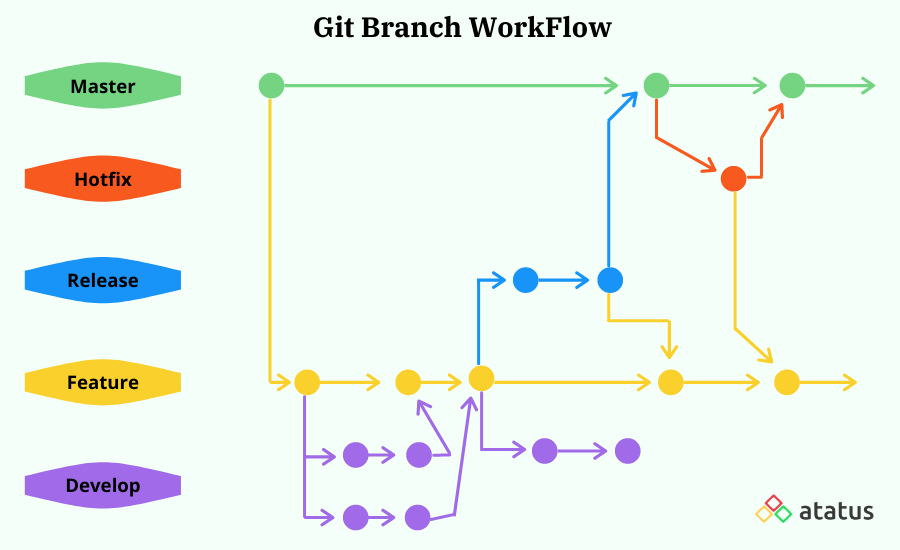
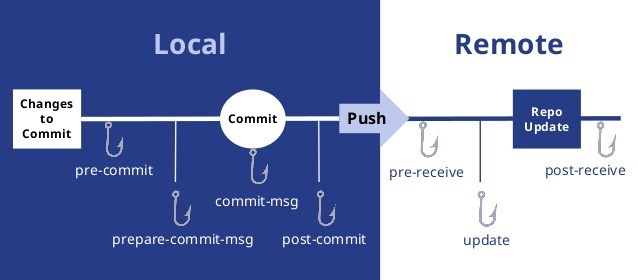

# Curso de Git y Github

## 1. Introduccion a Git

### 1.1. ¿Qué es git?

Es importante dejar claro que git no es lo mismo que GitHub, git es un sistema de control de versiones Open Source creado en el año 2005 por Linus Torvalds, el creador de Linux, por otro lado GitHub es un servicio de alojamiento para proyectos versionados con git, de esta forma podemos tener una copia local y una remota de nuestros repositorios.

Con git podemos entre otras cosas: tener un control de ediciones versionadas, regresar a versiones anteriores de nuestros proyectos, revisar el registro de cambios y crear ramas experimentales o mejoras paralelas al proyecto troncal.
- **¿Qué es el control de versiones?**
    Los sistemas de control de versiones son un tipo de software que ayuda a hacer un seguimiento de los cambios realizados en el código a lo largo del tiempo. 

    **Articulo :** (Learn Microsoft, ¿Qué es el control de versiones?) https://learn.microsoft.com/es-es/devops/develop/git/what-is-version-control
### 1.2. Instalación 
#### 1.2.1. Instalacion en Windows de Git y GitBash

Cuando instales Git Bash en Windows debes elegir si prefieres trabajar con la forma de Windows o la forma de UNIX (Linux y Mac).
Los comandos de UNIX son los más comunes entre los equipos de desarrollo.

#### Pasos

1. **Ir a la página de Github:** https://git-scm.com/downloads
2. **Descargar el instalador de Windows**
3. **Se debe iniciar el instalador con las siguientes configuraciones**
    - Asegurarse de marcar la opción **Git Bash**
    - **Activar TrueType** (Mejora las fuentes cuando usas la línea de comandos)
    - Marcar **Git from the command line and also from 3rd party software** (Recomendado)
    - Marcar **use the OpenSSL library**
    - Marcar **checkout Windows-style, commit unix-style line endings** (Compatibilidad con UNIX y Linux)
    - Marcar **MinTTY**
    - Ejecutar **Git Bash**

#### 1.2.2. Instalacion de Git en Linux

Este realiza con la ejecucion de un comando especifico para cada distribucion de Linux.

**Cada distribución tiene su comando especial y debes averiguar cómo funciona para poder instalar Git.**

- En las distribuciones derivadas de Debian **(como Ubuntu)** el comando especial es **`apt-get`** 
- En **Red Hat** es **`yum`** y en **`ArchLinux`** es **`pacman`**.

Antes de hacer la instalación, debemos hacer una actualización del sistema. En nuestro caso, los comandos para hacerlo son **`sudo apt-get update`** y **`sudo apt-get upgrade`**.

Con el sistema actualizado, ahora sí podemos instalar Git y, en este caso, el comando para hacerlo es **`sudo apt-get install git`**. 

Para verificar que Git fue instalado correctamente con el comando **`git --version`**.

### 1.3. Configuración básica
Es importante configurar al menos un nombre de usuario y un correo electrónico, para ello escribes en la terminal `git config --global user.name ‘tunombre’`, pasando entre comillas tu nombre de usuario y `git config --global user.email tuemail` pasando sin comillas tu email.

### 1.4. Inicializar un repositorio
Para que la carpeta de un proyecto en tu equipo pase a ser un repositorio de git debes inicializarla, en la terminal debes posicionarte en la carpeta del proyecto y escribir `git init`, esto creará una carpeta oculta de nombre .git la cual contiene toda la información del versionamiento.

A continuación se hace necesario comprender los estados de git en nuestro repositorio local y los comando necesarios para movernos entre ellos.

En la imagen de referencia se describen tres estados: el working directory, este es el sistema de archivos en el cual trabajamos, el staging area, un área temporal en el que añadimos los archivos cuyos cambios estamos por enviar a git y el repository, donde se versiona nuestro trabajo.
## 2. States y commits
### 2.1. ¿Qué es el staging?
 Crear un área en la memoria RAM, que conocemos como **Staging**, que guardará temporalmente nuestros archivos **(cuando ejecutemos un comando especial para eso)** y nos permitirá, más adelante, guardar estos cambios en el repositorio **(también con un comando especial)**.
 ### 2.2. Ciclo de vida de los archivos en Git:

Cuando trabajamos con Git, nuestros archivos pueden vivir y moverse entre **4 diferentes estados:**

- **Archivos Untracked:** Son archivos que NO viven dentro de Git, solo en el disco duro. Nunca han sido afectados por **`git add`**, así que Git no tiene registros de su existencia.

- **Archivos Unstaged:** Entiendelos como archivos **“Tracked pero Unstaged”**. Son archivos que viven dentro de Git pero no han sido afectados por el comando **`git add`** ni mucho menos por **`git commit`**. Git tiene un registro de estos archivos pero está desactualizado, sus últimas versiones solo están guardadas en el disco duro.

- **Archivos Staged:** Son archivos en Staging. Viven dentro de Git y hay registro de ellos porque han sido afectados por el comando **`git add`**, aunque no sus últimos cambios. Git ya sabe de la existencia de estos últimos cambios pero todavía no han sido guardados definitivamente en el repositorio porque falta ejecutar el comando **`git commit`**.

**`git add <archivo>`** Añade el archivo que le pasemos a staging area, y que luego estará en el commit.

**`git add <archivo1> <archivo2>`** Añade varios archivos a staging.

**`git add .`** El **"."** agrega todo a staging.

- **Archivos Tracked:** Son los archivos que viven dentro de Git, no tienen cambios pendientes y sus últimas actualizaciones han sido guardadas en el repositorio gracias a los comandos **`git add`** y **`git commit`.**

**Recuerda que hay un caso muy raro donde los archivos tienen dos estados al mismo tiempo: Staged y Untracked.**  
Esto pasa cuando guardas los cambios de un archivo en el área de **Staging (con el comando `git add`)** pero, antes de hacer commit para guardar los cambios en el repositorio, haces nuevos cambios que todavía no han sido guardados en el área de **Staging .**

Para comprobar el estado de los archivos escribimos **`git status`**, de esta forma sabrás cuales están en el staging area listo para ser enviados al repositorio.
## 3. Ramas, merge y conflictos.
### 3.1. Ramas o Branch's

###  ¿Qué es un Branch (Rama)?
Una rama o branch es una versión del código del proyecto sobre el que estás trabajando. Estas ramas ayudan a mantener el orden en el control de versiones y manipular el código de forma segura.

En otras palabras, un branch o rama en Git es una rama que proviene de otra. Imagina un árbol, que tiene una rama gruesa, y otra más fina, en la rama más gruesa tenemos los commits principales y en la rama fina tenemos otros commits que pueden ser de hotfix, devlopment entre otros.ㅤ
### Para crear una nueva rama
**`git branch <nombre_rama>`**

 Por ejemplo: **`git branch someTest`**

### Para cambiarse de rama
**`git checkout <nombre_rama>`** 

Por ejemplo: **`git checkout mi-rama`**

**`git switch <nombre_rama>`** 

Por ejemplo: **`git switch mi-rama`**

### Trabaja en tu rama
Dentro de tu rama puedes trabajar normal, hacer tus commits y avanzar en el proyecto, pero lo que haces está sólo en esa rama.

Si cambias de rama sin más lo que hayas hecho en esa rama no lo vas a ver.

Para poder juntar todo tienes que **mergear** (fundir o fusionar) las ramas.

### 3.2. Merge
### ¿Qué es un Merge?
Hacer un merge es la fusion de dos ramas, debes estar sobre la rama que quieres que permanezca (Por ejemplo: hacer un merge de un feature a la rama develop).

**`git merge <Nombre rama a fusionar>`**

**Crear un nuevo commit en la rama master combinando**
**los cambios de la rama cabecera:**

- **`git checkout master`**
- **`git merge cabecera`**

**Crear un nuevo commit en la rama cabecera combinando los cambios de cualquier otra rama:**

- **`git checkout cabecera`**
- **`git merge <cualquier-otra-rama>`**

Debemos tomar en cuenta que al fusionar dos ramas, pueden ocasionarse **conflictos.**
### 3.3. Conflictos
### Solución de conflictos al hacer un merge

**Git nunca borra nada a menos que nosotros se lo indiquemos.** Cuando usamos los comandos **`git merge`** o **`git checkout`** estamos cambiando de rama o creando un nuevo commit, no borrando ramas ni commits **(recuerda que puedes borrar commits con `git reset` y ramas con `git branch -d`)**.

Git es muy inteligente y puede resolver algunos conflictos automáticamente: cambios, nuevas líneas, entre otros. Pero algunas veces no sabe cómo resolver estas diferencias, **por ejemplo, cuando dos ramas diferentes hacen cambios distintos a una misma línea.**

Esto lo conocemos como conflicto y lo podemos resolver manualmente, solo debemos **hacer el merge, ir a nuestro editor de código y elegir si queremos quedarnos con alguna de estas dos versiones o algo diferente.** Algunos editores de código como **VSCode** nos ayudan a resolver estos conflictos sin necesidad de borrar o escribir líneas de texto, basta con hundir un botón y guardar el archivo.

Recuerda que siempre debemos crear un nuevo commit para aplicar los cambios del merge. Si Git puede resolver el conflicto hará commit automáticamente. Pero, en caso de no pueda resolverlo, debemos solucionarlo y hacer el commit.

Los archivos con conflictos por el comando **`git merge`** entran en un nuevo estado que conocemos como **Unmerged**. Funcionan muy parecido a los archivos en estado **Unstaged**, algo así como un estado intermedio entre **Untracked** y **Unstaged**, solo debemos ejecutar **`git add`** para pasarlos al área de staging y **`git commit`** para aplicar los cambios en el repositorio.
## 4. GitHub
Las cuentas te permiten organizar y controlar el acceso a dicho código. Existen tres tipos de cuentas en GitHub.

- Cuentas personales
- Cuentas de organización
- Cuenta de empresa

A cerca de los tipos de cuenta: https://docs.github.com/es/get-started/learning-about-github/types-of-github-accounts
### 4.1. Registrarse para una cuenta personal nueva
1. Vaya a https://github.com/

2. Haga clic en **Registrarse.**

3. Sigue las indicaciones para crear tu cuenta personal.

Durante el registro, se te pedirá que verifiques tu dirección de correo electrónico. Sin una dirección de correo electrónico verificada, no podrás completar algunas tareas básicas de GitHub, como crear un repositorio.

Si tienes problemas para comprobar la dirección de correo electrónico, hay algunos pasos de solución de problemas que puedes seguir. Para obtener más información, vea **«Verificar tu dirección de correo electrónico».**

### 4.2. Creando Repositorio remoto en github

- Documentacion GitHub , creacion de repositorio rapido:

https://docs.github.com/es/repositories/creating-and-managing-repositories/quickstart-for-repositories?tool=webui#create-a-repository

### 4.3. Repositorio remoto

GitHub es una de la posibilidades que tienes para crear tu repositorio de forma remota. Para ello debes crear un repositorio, darle un nombre y si quieres escribes una descripción. El comando que te permite asociar tu repositorio local (previamente inicializado) con el remoto es: 

**`git remote add`** **`origin https://github.com/nombre-usuario/nombre-repositorio.git`**

luego para subir el repositorio local ejecutas git push -u origin master, origin master es como se nombra a este repositorio remoto.

Si lo que deseas es descargar tu repositorio en otro equipo puedes clonar tu repositorio remoto con el comando: 

**`git clone`** `https://github.com/nombre-usuario/nombre-repositorio.git` 

Por último ya que alguien más del equipo de desarrollo pudo haber subido algún cambio, para no estar trabajando en una versión desactualizada debes bajar la última actualización de tu repositorio remoto a tu local, esto se hace con `git pull origin master`. Pull trae los cambio y push los envía.

`git fetch` Descarga el historial del repo remoto.

### Creando un projecto desde cero desde local
git init
git add README.md
git add .
git commit -m "first commit"
git remote add origin https:// github.com / <userName> / <repoName>.git
git push --force origin master

### ¿Tu repositorio local no está apuntando al repositorio remoto?

`git remote add <nombre_para_remoto> <url>`

Ejemplo: **`git remote add origin https://github.com/usuario/nombre_del_repositorio.git`**

`git push -u origin master`

Cuando hagas push, recuerda hacerlo a ambos (o tendrás un bonito caos...)

### Quieres apuntar a un nuevo proyecto en Github?

`git remote set-url <remote_name> <remote_url>` 

`git remote set-url origin nombre-app`

### Configurar Git

`git config --global user.name "nombre"`

`git config --global user.email "tu_mail@example.com"`

`git config --list`

Comprobar q está todo ok.

### Clonar un repositorio de GitHub al local

`git clone <url del proyecto>`

Crear un repositorio en local dentro de la carpeta que queremos, pero trayéndolo de GitHub.

La url la cogemos de la ventana que sale al pulsar el botón de 'Clone or download'.

Hay una opción para mejorar la velocidad y el espacio en disco al clonar un repositorio
`git clone <url del proyecto> --depth 1` con el valor a 1
No te descargará todo el historial del repositorio, a veces, ni siquiera lo necesitas. Especialmente interesante para procesos en CI.

#### Elimina Git del proyecto para empezar de nuevo
`rm -rf .git`

## 5. Trucos de Git, Hooks y Alias 

## 5.1. Trucasos en Git

### Recuperar un archivo en concreto de otra rama o commit:

**`git checkout <SHA> <archivo-e>`**

### Guardar cambios temporalmente:

**`git stash`**

**`git stash -u`**

**`git stash pop`**
### Detectar que commit es el que ha introducido un bug:

**`git bisect`**

**`git bisect start`**

**`git bisect bad`**

**`git bisect good <commit>`**

**`git bisect reset`**

### Aplicar cambios de commits en específico:

**`git cherry-pick <commit>`**

### Cambiar el nombre de un commit

**`git commit --amend -m <descripcion>`**

## 5.2. Hooks

El hook es un punto de enganche, es la posibilidad de ejecutar script cada vez que ocurre un evento en git.

Tenemos dos tipos de Hook's :

- Del lado del servidor
- Del lado del Cliente

### Creacion de un Hook

Para crear un hook debemos crear un archivo en la carpeta **`.git/hooks`** con el nombre del hook que queremos crear.

### Hooks del lado del **SERVIDOR:**

- **pre-receive:**

    Ayudan a verificar que el usuario que intenta grabar los commits tiene permisos necesarios para hacerlo.

- **update:**

  Se puede llegar de una forma a atomizar cada actualización.

- **post-receive:**
  Enviar un correo a todos los usuarios del repositorio que se han grabado nuevos cambios en el repositorio remoto.

### Hooks del lado del **CLIENTE:**

Estos solo funcionan dentro del repositorio local.

- **pre-commit**:

    Puede ser un buen sitio para ejecutar el linter sobre los archivos que han sido modificados

- **prepare-commit-msg**:
    
    Para modificar el mensaje del commit o añadir cualquier información extra.
- **commit-msg**:
    
    Es el sitio perfecto para hacer todas las comprobaciones pertinentes al mensaje.

- **post-commit:**

    Su uso principal es la de notificar por Slack.
- **pre-push:**
    
    Para ejecutar una bateria de tests.

- **post-merge & post-checkout:**
     
     Permite limpiar el directorio de trabajo, tras realizar un checkout, o el de limpiar las ramas que ya no se usan tras realizar un merge.

## 5.3.  Alias

Los alias te ayudan definir una serie de comandos que pueden ser usados en lugar de los nombres completos.

- **`git cm -> git commit`**

- **`git sts -> git status`**

#### Creacion de un Alias

**`git config --global alias.co commit`**

**`git config --global alias.wo "log --oneline"`**

#### Eliminacion de un Alias

**`git config --global --unset alias.co`**
## 6. Resumen de comandos git

|Comando                  | Función                                                    |
|-------------------------|------------------------------------------------------------|
| git init                | inicializa un repositorio                                  |
| git add                 | agrega cambios a staging area                              |
| git status              | muestra el estado de los cambios                           |
| git reset HEAD          | elimina un cambio del staging area                         |
| git commit              | envía un cambio del staging al repositorio                 |
| git rm                  | borra cambio del repositorio                               |
| git checkout            | trae la última versión del cambio, crea y cambia de rama   |
| git branch              | muestra las ramas                                          |
| git merge               | fusiona las ramas                                          |
| git remote add origin   | relacionar repo local a un repo remoto                     |
| git clone               | clonar repositorio remoto                                  |
| git pull                | trae la última versión del repo remoto                     |
| git push                | envía los cambio al repo remoto                            |

